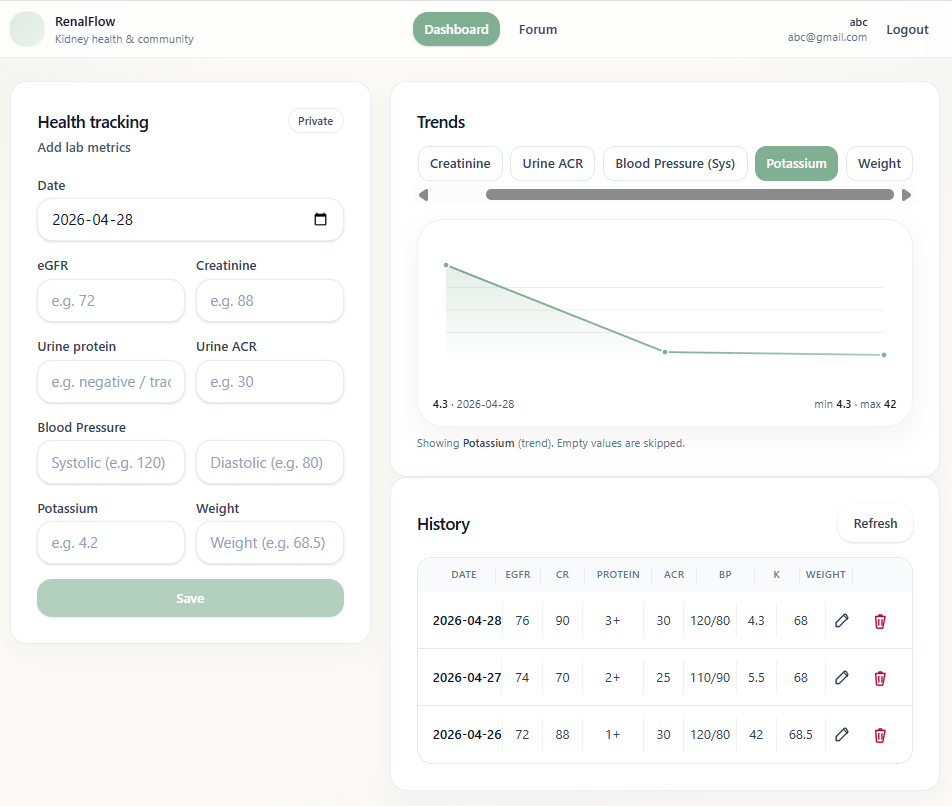
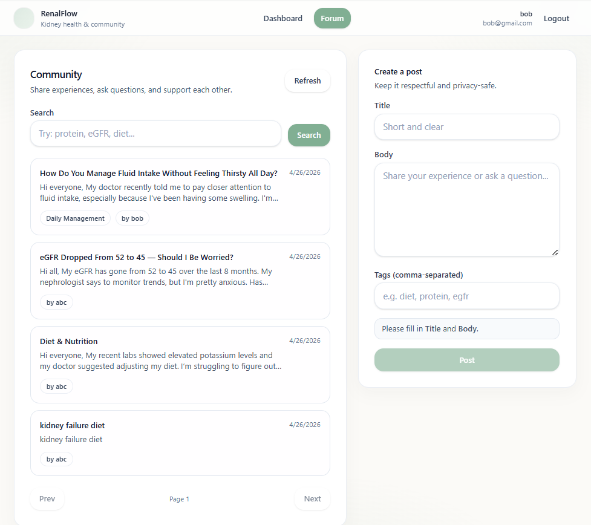

# RenalFlow 

Kidney health tracking + community forum.





## Key features

- **Auth**: register / login (JWT access token + refresh token)
- **Health tracking (customer only)**: add / edit / delete lab metrics + trends chart + history table
- **Community forum**: create posts, reply/comments, search, pagination
- **Admin moderation (admin only)**: can delete **posts** and **comments**

## Project structure

```
RenalFlow/
├── server/   # Express + MongoDB + JWT (+ optional Redis + optional Elasticsearch)
└── web/      # React + Vite + Tailwind + Zustand
```

## Run locally

### Prerequisites

- **Node.js**: 18+
- **MongoDB**: local or Atlas

### 1) Backend (`server/`)

Create `server/.env` from `server/.env.example`.

Minimum required:

```env
PORT=4000
MONGO_URI=mongodb://...
ACCESS_TOKEN_SECRET=change-me
REFRESH_TOKEN_SECRET=change-me
```

Optional (recommended):

```env
# Admin accounts (comma-separated emails). Register with one of these emails to become admin.
ADMIN_EMAILS=admin@example.com

# Refresh-token store (if omitted, server falls back to in-memory for local dev)
UPSTASH_REDIS_URL=

# Forum fuzzy search
# - elasticsearch: requires a running ES node
# - mongo: fallback (basic substring matching)
FORUM_SEARCH_PROVIDER=elasticsearch
ELASTICSEARCH_NODE=http://localhost:9200
ELASTICSEARCH_INDEX=forum-posts
```

Start server:

```bash
cd server
npm install
npm run dev
```

Health check: `GET /api/health`

### 2) Web (`web/`)

Start web app:

```bash
cd web
npm install
npm run dev
```

Open the printed Vite URL (usually `http://localhost:5173`).

## Notes

- **Admin role**: set `ADMIN_EMAILS`, then **register a new account** with that email (existing accounts won’t auto-upgrade).

